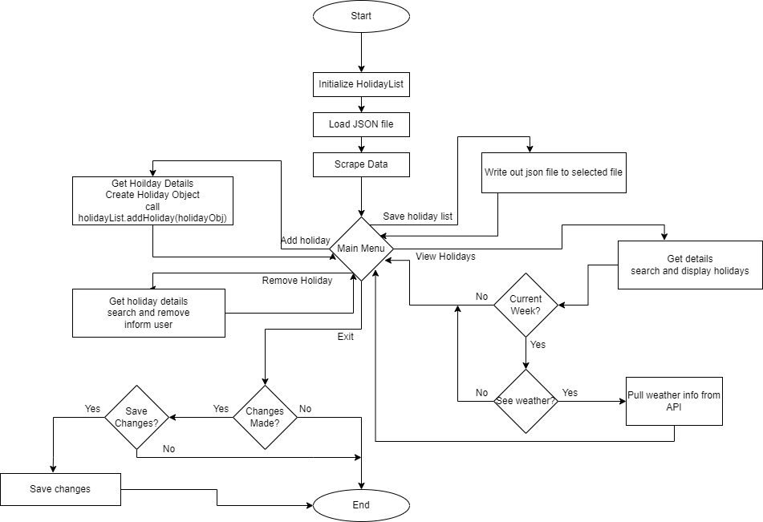

# Holiday Manager
This is applicaation that tracks holidays.

When the program starts it loads initial holiday data from the given json file.
Then it scrapes additional holidays from https://www.timeanddate.com/holidays/us/ the present year, 2 years of past holidays, and 2 years of future holidays.

After that it will show menu options for interactions.

Holiday data from: 
Weather data from: 
