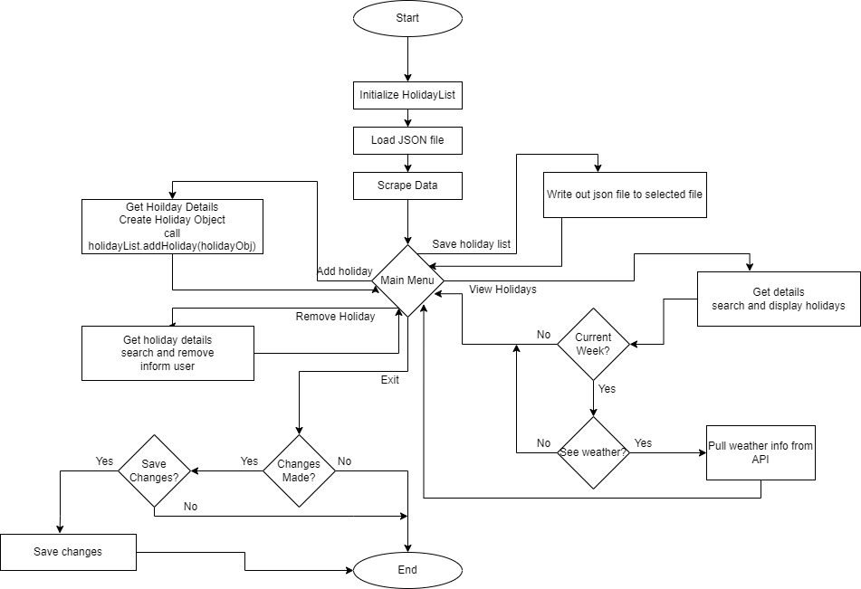

# Holiday Manager
This is an applicaation that tracks holidays.

When the program starts it loads initial holiday data from the given json file.
Then it scrapes additional holidays from https://www.timeanddate.com/holidays/us/ the present year, 2 years of past holidays, and 2 years of future holidays.


After that it will show menu options for interactions.


Sample run

```
Holiday Management
===================
There are 2562 holidays stored in the system.

Holiday Menu
================
1. Add a Holiday
2. Remove a Holiday
3. Save Holiday List
4. View Holidays
5. Exit
Enter 1-5: 1

Add a Holiday
================
Holdiay Name: holiday 4
Date: 2022-1-10
holiday 4 (2022-01-10) was added to the list.

Holiday Management
===================
There are 2563 holidays stored in the system.

Holiday Menu
================
1. Add a Holiday
2. Remove a Holiday
3. Save Holiday List
4. View Holidays
5. Exit
Enter 1-5: 2

Remove a Holiday
================
Holdiay Name: Christmas Day  
Date: 2024-12-25
Success:
Christmas Day (2024-12-25) has been removed from the holiday list.

Holiday Management
===================
There are 2562 holidays stored in the system.

Holiday Menu
================
1. Add a Holiday
2. Remove a Holiday
3. Save Holiday List
4. View Holidays
5. Exit
Enter 1-5: 3

Saving Holiday List
================
Are you sure you want to save your changes? [y/n]:y
Success:
Your changes have been saved.

Holiday Management
===================
There are 2562 holidays stored in the system.

Holiday Menu
================
1. Add a Holiday
2. Remove a Holiday
3. Save Holiday List
4. View Holidays
5. Exit
Enter 1-5: 4

View Holidays
=================
Which year?[2020-2024 Leave blank for the current year]:
Which week? #[1-52, Leave blank for the current week]: 
Would you like to see this week's weather? [y/n]: y
get weather Called

These are the holidays for this week:
Stephen Foster Memorial Day (2022-01-13) - Weather not avaliable at this time
Orthodox New Year (2022-01-14) - Weather not avaliable at this time
World Religion Day (2022-01-16) - Weather not avaliable at this time
h1 (2022-01-10) - -3.7 F, Sunny
h2 (2022-01-11) - 21.5 F, Overcast
h3 (2022-01-12) - 22.4 F, Mist
holiday 4 (2022-01-10) - -3.7 F, Sunny

Holiday Management
===================
There are 2562 holidays stored in the system.

Holiday Menu
================
1. Add a Holiday
2. Remove a Holiday
3. Save Holiday List
4. View Holidays
5. Exit
Enter 1-5: 4

View Holidays
=================
Which year?[2020-2024 Leave blank for the current year]: 2021
Which week? #[1-52, Leave blank for the current week]: 25

These are the holidays for 2021 week #25:
International Day of Yoga (2021-06-21)
International Day of the Celebration of the Solstice (2021-06-21)
West Virginia Day observed (2021-06-21)
Public Service Day (2021-06-23)
International Widows' Day (2021-06-23)
Day of the Seafarer (2021-06-25)
International Day Against Drug Abuse and Illicit Trafficking (2021-06-26)
International Day in Support of Victims of Torture (2021-06-26)
Micro-, Small and Medium-sized Enterprises Day (2021-06-27)

Holiday Management
===================
There are 2562 holidays stored in the system.

Holiday Menu
================
1. Add a Holiday
2. Remove a Holiday
3. Save Holiday List
4. View Holidays
5. Exit
Enter 1-5: 5

Exit
================
Are you sure you want to exit? [y/n]: y
Goodbye!
```


## Flowchart
___



Holiday data from: https://www.timeanddate.com/holidays/us/
Weather data from: https://rapidapi.com/weatherapi/api/weatherapi-com/

___
# Assessment Instructuions

___
## Introduction
Martin Luther King Day, Presidents Day, St. Patrick's Day, Easter, May Day, Independence Day for multiple cultures, International Talk Like a Pirate Day... these are just some of the many holidays out there.

You will be designing a text-based application to track holidays.

High-Level Requirements
The application user is a member of the marketing team.

The admin needs to be able to manage holidays in an easy-to-use interface.
The admin already knows about a starting JSON file named holidays.json and appreciates that we have seeded the application with a base of holidays.
They want all of the holidays from [https://www.timeanddate.com/holidays/us/](https://www.timeanddate.com/holidays/us/) to also be preloaded. Only preload holidays with concrete dates. Do not calculate holiday dates. The team expects you to include holidays from the present year, 2 years of past holidays, and 2 years of future holidays
The holidays must be saved in JSON, following the formatting of the provided file.
With the holidays approaching, the marketing person may want to know what the weather looks like so they can determine what to market more. Use a weather API to show what the weather looks like for the current period. (See the notes below for details.) We recommend [Open Weather Map API](https://rapidapi.com/community/api/open-weather-map), but you are free to use any weather API you would like.
___
## Technical Requirements
Do not use pandas. If you use pandas for this assessment, you will have to refactor your code.

Use the provided starter code which includes pseudo-code and some instructions so instructional staff can automatically test your code. You may need more functions then the provided functions in the starter code.
There is a starting JSON file named holidays.json to give you an idea of what kind of data will be used.
Holidays should be represented as objects in Python.
The List of Holidays should be represented as an object in Python (see starter code for details)
The holiday class should include a way to display a holiday in the following format:
Holiday Name (Date)
Use a lambda expression for printing out holidays for a selected week.
Use flowcharts or pseudo code to visualize the design plan for your application based on your interpretation of the starter code.
___
## Approach
Objects are commonly used when working with formatted data - such as JSON or XML.

These are questions that should be answered by demonstrating them in your code:

What is a lambda expression?
What are classes?
How do you use Beautiful Soup for web scraping?
How do you consume an API?
How do you store data in JSON?
___
## Stretch Goals
Allow searching for a single date and return all holidays for that date.

Add tags for holidays to find things such as food-related holidays, religious holidays, and cultural holidays. Then, allow for searching for all holidays by tag.

Save the file in another (additional) file format. Note: This would require a way for the user to specify which format to save in. JSON must be implemented. An additional file format is the stretch part.

Calculate dates for variable holidays - such as Mother's Day, Father's Day, Easter, and Election Day (Difficult stretch goal).

Please note: Some of the stretch goals will require you to change your menu and menu logic as well as add functions to the HolidayList Class.